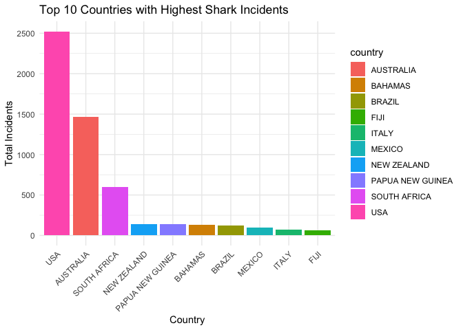
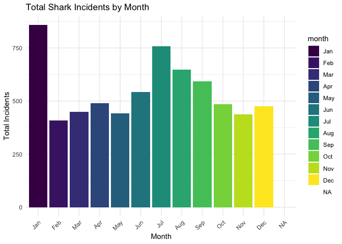
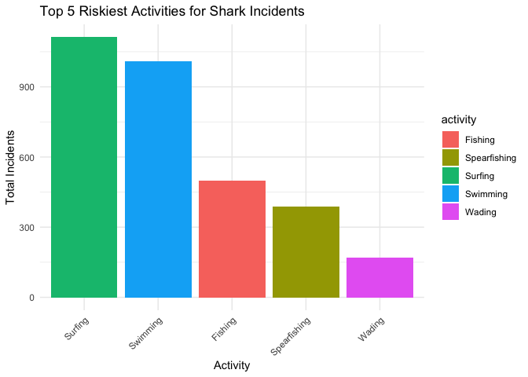
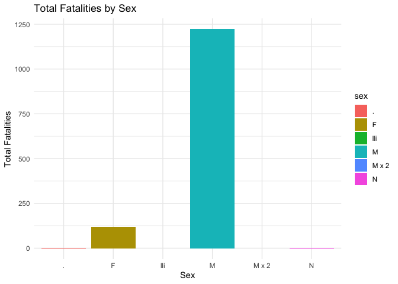
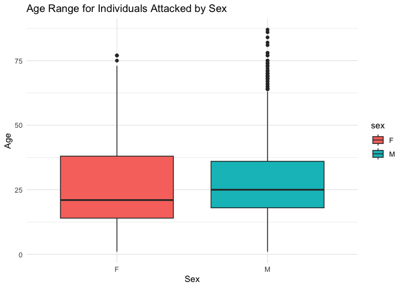
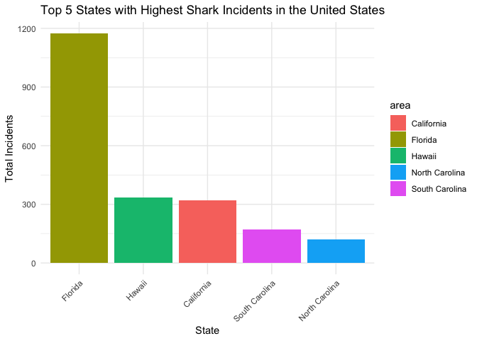
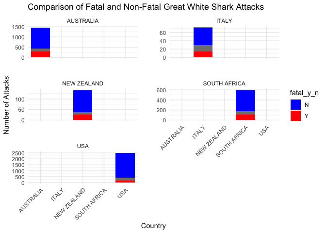
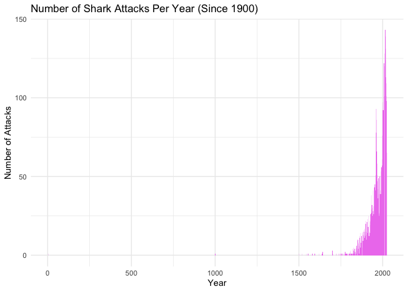

## Instructions
Answer the following questions and complete the exercises in RMarkdown. Please embed all of your code and push your final work to your repository. Your code must be organized, clean, and run free from errors. Remember, you must remove the `#` for any included code chunks to run. Be sure to add your name to the author header above. 

Your code must knit in order to be considered. If you are stuck and cannot answer a question, then comment out your code and knit the document.  

Don't forget to answer any questions that are asked in the prompt. Some questions will require a plot, but others do not- make sure to read each question carefully.  

For the questions that require a plot, make sure to have clearly labeled axes and a title. Keep your plots clean and professional-looking, but you are free to add color and other aesthetics.  

Be sure to follow the directions and push your code to your repository.

## Background
In the `data` folder, you will find data about global shark attacks. The data are updated continuously, and are taken from [opendatasoft](https://public.opendatasoft.com/explore/dataset/global-shark-attack/table/?flg=en-us&disjunctive.country&disjunctive.area&disjunctive.activity).  

## Load the libraries

```r
library("tidyverse")
library("janitor")
library("naniar")
library("lubridate")
library("ggplot2")
```

## Load the data
Run the following code chunk to import the data.

```r
global_sharks <- read_csv("data/global-shark-attack.csv") %>% clean_names()
```

## Questions
1. (2 points) Start by doing some data exploration using your preferred function(s). What is the structure of the data? Where are the missing values and how are they represented?  


```r
str(global_sharks)
```

```
## spc_tbl_ [6,890 × 21] (S3: spec_tbl_df/tbl_df/tbl/data.frame)
##  $ date                  : Date[1:6890], format: "2023-07-29" "2023-04-22" ...
##  $ year                  : num [1:6890] 2023 2023 2023 2023 2022 ...
##  $ type                  : chr [1:6890] "Unprovoked" "Unprovoked" "Unprovoked" "Questionable" ...
##  $ country               : chr [1:6890] "USA" "AUSTRALIA" "SEYCHELLES" "ARGENTINA" ...
##  $ area                  : chr [1:6890] "Florida" "Western Australia" "Praslin Island" "Patagonia" ...
##  $ location              : chr [1:6890] "Tampa Bay" "Lucy's Beach" NA "Chubut Province" ...
##  $ activity              : chr [1:6890] "Swimming" "Surfing" "Snorkeling" NA ...
##  $ name                  : chr [1:6890] "Natalie Branda" "Max Marsden" "Arthur \xc9" "Diego Barr\x92a" ...
##  $ sex                   : chr [1:6890] "F" "M" "M" "M" ...
##  $ age                   : chr [1:6890] "26" "30" "6" "32" ...
##  $ injury                : chr [1:6890] "Superficial injuries to abomen and thighs" "Bite to right arm" "Left foot bitten" "Death by misadventure" ...
##  $ fatal_y_n             : chr [1:6890] "N" "N" "UNKNOWN" "UNKNOWN" ...
##  $ time                  : chr [1:6890] "20h00" "07h15" "Afternoon" NA ...
##  $ species               : chr [1:6890] NA "Bronze whaler shark, 1.5 m" "Lemon shark" NA ...
##  $ investigator_or_source: chr [1:6890] "Fox12, 8/1/2023" "The West Australian, 4/22/2023" "Midlibre, 3/18/2023" "El Pais,  2/27/2023" ...
##  $ pdf                   : chr [1:6890] NA NA NA NA ...
##  $ href_formula          : chr [1:6890] NA NA NA NA ...
##  $ href                  : chr [1:6890] NA NA NA NA ...
##  $ case_number_19        : chr [1:6890] NA NA NA NA ...
##  $ case_number_20        : chr [1:6890] NA NA NA NA ...
##  $ original_order        : num [1:6890] NA NA NA NA 6792 ...
##  - attr(*, "spec")=
##   .. cols(
##   ..   Date = col_date(format = ""),
##   ..   Year = col_double(),
##   ..   Type = col_character(),
##   ..   Country = col_character(),
##   ..   Area = col_character(),
##   ..   Location = col_character(),
##   ..   Activity = col_character(),
##   ..   Name = col_character(),
##   ..   Sex = col_character(),
##   ..   Age = col_character(),
##   ..   Injury = col_character(),
##   ..   `Fatal (Y/N)` = col_character(),
##   ..   Time = col_character(),
##   ..   Species = col_character(),
##   ..   `Investigator or Source` = col_character(),
##   ..   pdf = col_character(),
##   ..   `href formula` = col_character(),
##   ..   href = col_character(),
##   ..   `Case Number...19` = col_character(),
##   ..   `Case Number...20` = col_character(),
##   ..   `original order` = col_double()
##   .. )
##  - attr(*, "problems")=<externalptr>
```


```r
glimpse(global_sharks)
```

```
## Rows: 6,890
## Columns: 21
## $ date                   <date> 2023-07-29, 2023-04-22, 2023-03-02, 2023-02-18…
## $ year                   <dbl> 2023, 2023, 2023, 2023, 2022, 2022, 2021, 2021,…
## $ type                   <chr> "Unprovoked", "Unprovoked", "Unprovoked", "Ques…
## $ country                <chr> "USA", "AUSTRALIA", "SEYCHELLES", "ARGENTINA", …
## $ area                   <chr> "Florida", "Western Australia", "Praslin Island…
## $ location               <chr> "Tampa Bay", "Lucy's Beach", NA, "Chubut Provin…
## $ activity               <chr> "Swimming", "Surfing", "Snorkeling", NA, "Snork…
## $ name                   <chr> "Natalie Branda", "Max Marsden", "Arthur \xc9",…
## $ sex                    <chr> "F", "M", "M", "M", "F", "M", "M", "M", "M", "M…
## $ age                    <chr> "26", "30", "6", "32", NA, "21.0", "15.0", "73.…
## $ injury                 <chr> "Superficial injuries to abomen and thighs", "B…
## $ fatal_y_n              <chr> "N", "N", "UNKNOWN", "UNKNOWN", "N", "N", "N", …
## $ time                   <chr> "20h00", "07h15", "Afternoon", NA, "12h30", "15…
## $ species                <chr> NA, "Bronze whaler shark, 1.5 m", "Lemon shark"…
## $ investigator_or_source <chr> "Fox12, 8/1/2023", "The West Australian, 4/22/2…
## $ pdf                    <chr> NA, NA, NA, NA, "2022.07.28-Cornwall.pdf", "202…
## $ href_formula           <chr> NA, NA, NA, NA, "http://sharkattackfile.net/spr…
## $ href                   <chr> NA, NA, NA, NA, "http://sharkattackfile.net/spr…
## $ case_number_19         <chr> NA, NA, NA, NA, "2022.07.28", "2022.03.09", "20…
## $ case_number_20         <chr> NA, NA, NA, NA, "2022.7.28", "2022.03.09", "202…
## $ original_order         <dbl> NA, NA, NA, NA, 6792, 6743, 6720, 6626, 6618, 6…
```


```r
names(global_sharks)
```

```
##  [1] "date"                   "year"                   "type"                  
##  [4] "country"                "area"                   "location"              
##  [7] "activity"               "name"                   "sex"                   
## [10] "age"                    "injury"                 "fatal_y_n"             
## [13] "time"                   "species"                "investigator_or_source"
## [16] "pdf"                    "href_formula"           "href"                  
## [19] "case_number_19"         "case_number_20"         "original_order"
```

```r
global_sharks
```

```
## # A tibble: 6,890 × 21
##    date        year type       country area  location activity name  sex   age  
##    <date>     <dbl> <chr>      <chr>   <chr> <chr>    <chr>    <chr> <chr> <chr>
##  1 2023-07-29  2023 Unprovoked USA     Flor… Tampa B… Swimming "Nat… F     26   
##  2 2023-04-22  2023 Unprovoked AUSTRA… West… Lucy's … Surfing  "Max… M     30   
##  3 2023-03-02  2023 Unprovoked SEYCHE… Pras… <NA>     Snorkel… "Art… M     6    
##  4 2023-02-18  2023 Questiona… ARGENT… Pata… Chubut … <NA>     "Die… M     32   
##  5 2022-07-28  2022 Unprovoked ENGLAND Corn… Penzance Snorkel… "fem… F     <NA> 
##  6 2022-03-09  2022 Provoked   USA     Flor… New Smy… Fishing  "mal… M     21.0 
##  7 2021-12-06  2021 Unprovoked AUSTRA… Vict… Ocean G… Swimming "Jac… M     15.0 
##  8 2021-01-22  2021 Unprovoked USA     Hawa… Maui     Snorkel… "Jer… M     73.0 
##  9 2021-01-02  2021 Unprovoked USA     Flor… Cocoa B… Surfing  "Kel… M     17.0 
## 10 2020-10-30  2020 Unprovoked BAHAMAS Gran… East En… Spearfi… "Ant… M     <NA> 
## # ℹ 6,880 more rows
## # ℹ 11 more variables: injury <chr>, fatal_y_n <chr>, time <chr>,
## #   species <chr>, investigator_or_source <chr>, pdf <chr>, href_formula <chr>,
## #   href <chr>, case_number_19 <chr>, case_number_20 <chr>,
## #   original_order <dbl>
```

2. (3 points) Are there any "hotspots" for shark incidents? Make a plot that shows the total number of incidents for the top 10 countries? Which country has the highest number of incidents?


```r
global_sharks %>%
  group_by(country) %>%
  summarize(total_incidents = n()) %>%
  arrange(desc(total_incidents))  
```

```
## # A tibble: 216 × 2
##    country          total_incidents
##    <chr>                      <int>
##  1 USA                         2522
##  2 AUSTRALIA                   1464
##  3 SOUTH AFRICA                 596
##  4 NEW ZEALAND                  142
##  5 PAPUA NEW GUINEA             136
##  6 BAHAMAS                      132
##  7 BRAZIL                       122
##  8 MEXICO                       100
##  9 ITALY                         72
## 10 FIJI                          67
## # ℹ 206 more rows
```

```r
ggplot(global_sharks %>%
         group_by(country) %>%
         summarize(total_incidents = n()) %>%
         arrange(desc(total_incidents)) %>%
         head(10), 
       aes(x = reorder(country, -total_incidents), y = total_incidents, fill = country)) +
  geom_bar(stat = "identity") +
  labs(title = "Top 10 Countries with Highest Shark Incidents",
       x = "Country",
       y = "Total Incidents") +
  theme_minimal() +
  theme(axis.text.x = element_text(angle = 45, hjust = 1))
```

<!-- -->
USA has the most shark incidents, with Australia being the second highest country with the most shark incidents.

3. (3 points) Are there months of the year when incidents are more likely to occur? Make a plot that shows the total number of incidents by month. Which month has the highest number of incidents?


```r
global_sharks <- global_sharks %>%
  mutate(month = month(date, label = TRUE))
ggplot(global_sharks, aes(x = month, fill = month)) +
  geom_bar() +
  labs(title = "Total Shark Incidents by Month",
       x = "Month",
       y = "Total Incidents") +
  scale_x_discrete(labels = month.abb) +
  theme_minimal() +
  theme(axis.text.x = element_text(angle = 45, hjust = 1))
```

<!-- -->
January has the most number of incidents with July following that as the second month with the most incidents. 


4. (3 points) Which activity is associated with the highest number of incidents? Make a plot that compares the top 5 riskiest activities. "NA" should not be classified as an activity.


```r
filtered_sharks <- global_sharks %>%
  filter(!is.na(activity) & activity != "NA")
incidents_by_activity <- filtered_sharks %>%
  group_by(activity) %>%
  summarize(total_incidents = n()) %>%
  arrange(desc(total_incidents))
top_activities <- head(incidents_by_activity, 5)
ggplot(top_activities, aes(x = reorder(activity, -total_incidents), y = total_incidents, fill = activity)) +
  geom_bar(stat = "identity") +
  labs(title = "Top 5 Riskiest Activities for Shark Incidents",
       x = "Activity",
       y = "Total Incidents") +
  theme_minimal() +
  theme(axis.text.x = element_text(angle = 45, hjust = 1))
```

<!-- -->

Surfing is the most risky activity associated with shark incidents. Swimming is the second riskiest activity for shark incidents. 

5. (3 points) The data include information on who was attacked. Make a plot that shows the total number of fatalities by sex- are males or females more likely to be killed by sharks?


```r
ggplot(global_sharks %>% 
         filter(!is.na(sex)) %>%
         group_by(sex) %>%
         summarize(total_fatalities = sum(fatal_y_n == "Y")),
       aes(x = sex, y = total_fatalities, fill = sex)) +
  geom_bar(stat = "identity") +
  labs(title = "Total Fatalities by Sex",
       x = "Sex",
       y = "Total Fatalities") +
  theme_minimal()
```

<!-- -->

Men are most likely to be killed from shark incidents than women. 

6. (3 points) Make a plot that shows the range of age for the individuals that are attacked. Make sure to restrict sex to M or F (some of the codes used are not clear). You will also need to find a way to manage the messy age column.


```r
cleaned_sharks <- global_sharks %>%
  filter(sex %in% c('M', 'F')) %>%
  mutate(cleaned_age = as.numeric(str_extract(age, "\\d+")))
ggplot(cleaned_sharks, aes(x = sex, y = cleaned_age, fill = sex)) +
  geom_boxplot() +
  labs(title = "Age Range for Individuals Attacked by Sex",
       x = "Sex",
       y = "Age") +
  theme_minimal()
```

```
## Warning: Removed 2480 rows containing non-finite values (`stat_boxplot()`).
```

<!-- -->


```r
cleaned_sharks <- global_sharks %>%
  filter(sex %in% c('M', 'F')) %>%
  mutate(cleaned_age = as.numeric(str_extract(age, "\\d+")))
cleaned_sharks %>%
  group_by(sex) %>%
  summarize(min_age = min(cleaned_age, na.rm = TRUE),
            median_age = median(cleaned_age, na.rm = TRUE),
            max_age = max(cleaned_age, na.rm = TRUE))
```

```
## # A tibble: 2 × 4
##   sex   min_age median_age max_age
##   <chr>   <dbl>      <dbl>   <dbl>
## 1 F           1         21      77
## 2 M           1         25      87
```


```r
cleaned_sharks
```

```
## # A tibble: 6,313 × 23
##    date        year type       country area  location activity name  sex   age  
##    <date>     <dbl> <chr>      <chr>   <chr> <chr>    <chr>    <chr> <chr> <chr>
##  1 2023-07-29  2023 Unprovoked USA     Flor… Tampa B… Swimming "Nat… F     26   
##  2 2023-04-22  2023 Unprovoked AUSTRA… West… Lucy's … Surfing  "Max… M     30   
##  3 2023-03-02  2023 Unprovoked SEYCHE… Pras… <NA>     Snorkel… "Art… M     6    
##  4 2023-02-18  2023 Questiona… ARGENT… Pata… Chubut … <NA>     "Die… M     32   
##  5 2022-07-28  2022 Unprovoked ENGLAND Corn… Penzance Snorkel… "fem… F     <NA> 
##  6 2022-03-09  2022 Provoked   USA     Flor… New Smy… Fishing  "mal… M     21.0 
##  7 2021-12-06  2021 Unprovoked AUSTRA… Vict… Ocean G… Swimming "Jac… M     15.0 
##  8 2021-01-22  2021 Unprovoked USA     Hawa… Maui     Snorkel… "Jer… M     73.0 
##  9 2021-01-02  2021 Unprovoked USA     Flor… Cocoa B… Surfing  "Kel… M     17.0 
## 10 2020-10-30  2020 Unprovoked BAHAMAS Gran… East En… Spearfi… "Ant… M     <NA> 
## # ℹ 6,303 more rows
## # ℹ 13 more variables: injury <chr>, fatal_y_n <chr>, time <chr>,
## #   species <chr>, investigator_or_source <chr>, pdf <chr>, href_formula <chr>,
## #   href <chr>, case_number_19 <chr>, case_number_20 <chr>,
## #   original_order <dbl>, month <ord>, cleaned_age <dbl>
```

7. (3 points) In the United States, what are the top 5 states where shark attacks have been recorded since 1950? Make a plot that compares the number of incidents for these 5 states.


```r
ggplot(global_sharks %>%
         filter(country == "USA") %>%
         group_by(area) %>%
         summarize(total_incidents = n()) %>%
         arrange(desc(total_incidents)) %>%
         head(5), 
       aes(x = reorder(area, -total_incidents), y = total_incidents, fill = area)) +
  geom_bar(stat = "identity") +
  labs(title = "Top 5 States with Highest Shark Incidents in the United States",
       x = "State",
       y = "Total Incidents") +
  theme_minimal() +
  theme(axis.text.x = element_text(angle = 45, hjust = 1))
```

<!-- -->
Florida has the highest number of shark incidents. 

8. (3 points) Make a new object that limits the data to only include attacks attributed to Great White Sharks. This is trickier than it sounds, you should end up with 494 observations. Look online and adapt code involving `str_detect`. Which country has the highest number of Great White Shark attacks?


```r
great_white_attacks <- global_sharks %>%
  filter(str_detect(str_replace_all(species, "[^[:alnum:] ]", ""), "(?i)White"))
print(nrow(great_white_attacks))
```

```
## [1] 733
```

```r
top_country_great_white <- great_white_attacks %>%
  group_by(country) %>%
  summarize(total_attacks = n()) %>%
  arrange(desc(total_attacks)) 
top_country_great_white
```

```
## # A tibble: 50 × 2
##    country      total_attacks
##    <chr>                <int>
##  1 USA                    230
##  2 AUSTRALIA              180
##  3 SOUTH AFRICA           171
##  4 ITALY                   26
##  5 NEW ZEALAND             21
##  6 EGYPT                   18
##  7 CROATIA                 11
##  8 CHILE                    6
##  9 GREECE                   5
## 10 BRAZIL                   4
## # ℹ 40 more rows
```

9. (4 points) Use faceting to compare the number of fatal and non-fatal attacks for the top 5 countries with the highest number of Great White Shark attacks.

```r
great_white_attacks <- global_sharks %>%
  filter(str_detect(str_replace_all(species, "[^[:alnum:] ]", ""), "(?i)white"))
top_countries <- great_white_attacks %>%
  group_by(country) %>%
  summarize(total_attacks = n()) %>%
  arrange(desc(total_attacks)) %>%
  head(5)
top_countries_data <- global_sharks %>%
  filter(country %in% top_countries$country)
ggplot(top_countries_data, aes(x = country, fill = fatal_y_n)) +
  geom_bar() +
  facet_wrap(~country, scales = "free_y", ncol = 2) +
  labs(title = "Comparison of Fatal and Non-Fatal Great White Shark Attacks",
       x = "Country",
       y = "Number of Attacks") +
  scale_fill_manual(values = c("Y" = "red", "N" = "blue")) +
  theme_minimal() +
  theme(axis.text.x = element_text(angle = 45, hjust = 1),
        panel.spacing = unit(2, "lines"))
```

<!-- -->

10. (3 points) Using the `global_sharks` data, what is one question that you are interested in exploring? Write the question and answer it using a plot or table. 


```r
global_sharks %>%
  mutate(year = lubridate::year(date)) %>%
  filter(year >= 1900)
```

```
## # A tibble: 6,020 × 22
##    date        year type       country area  location activity name  sex   age  
##    <date>     <dbl> <chr>      <chr>   <chr> <chr>    <chr>    <chr> <chr> <chr>
##  1 2023-07-29  2023 Unprovoked USA     Flor… Tampa B… Swimming "Nat… F     26   
##  2 2023-04-22  2023 Unprovoked AUSTRA… West… Lucy's … Surfing  "Max… M     30   
##  3 2023-03-02  2023 Unprovoked SEYCHE… Pras… <NA>     Snorkel… "Art… M     6    
##  4 2023-02-18  2023 Questiona… ARGENT… Pata… Chubut … <NA>     "Die… M     32   
##  5 2022-07-28  2022 Unprovoked ENGLAND Corn… Penzance Snorkel… "fem… F     <NA> 
##  6 2022-03-09  2022 Provoked   USA     Flor… New Smy… Fishing  "mal… M     21.0 
##  7 2021-12-06  2021 Unprovoked AUSTRA… Vict… Ocean G… Swimming "Jac… M     15.0 
##  8 2021-01-22  2021 Unprovoked USA     Hawa… Maui     Snorkel… "Jer… M     73.0 
##  9 2021-01-02  2021 Unprovoked USA     Flor… Cocoa B… Surfing  "Kel… M     17.0 
## 10 2020-10-30  2020 Unprovoked BAHAMAS Gran… East En… Spearfi… "Ant… M     <NA> 
## # ℹ 6,010 more rows
## # ℹ 12 more variables: injury <chr>, fatal_y_n <chr>, time <chr>,
## #   species <chr>, investigator_or_source <chr>, pdf <chr>, href_formula <chr>,
## #   href <chr>, case_number_19 <chr>, case_number_20 <chr>,
## #   original_order <dbl>, month <ord>
```

```r
ggplot(global_sharks, aes(x = year)) +
  geom_bar(stat = "count", fill = "violet") +
  labs(title = "Number of Shark Attacks Per Year (Since 1900)",
       x = "Year",
       y = "Number of Attacks") +
  theme_minimal()
```

```
## Warning: Removed 132 rows containing non-finite values (`stat_count()`).
```

<!-- -->

```r
global_sharks %>%
  mutate(year = lubridate::year(date)) %>%
  filter(year >= 1900) %>% 
  group_by(year) %>%
  summarize(total_incidents = n()) %>%
  arrange(year) %>%
  mutate(total_incidents = cumsum(total_incidents)) %>% 
  arrange(desc(total_incidents))
```

```
## # A tibble: 124 × 2
##     year total_incidents
##    <dbl>           <int>
##  1  2023            6020
##  2  2022            5957
##  3  2021            5859
##  4  2020            5752
##  5  2019            5653
##  6  2018            5541
##  7  2017            5417
##  8  2016            5277
##  9  2015            5146
## 10  2014            5003
## # ℹ 114 more rows
```

I wanted to see how the shark incident rate has changed over the years. The years under 1800 were ommitted since they were outliers. 

