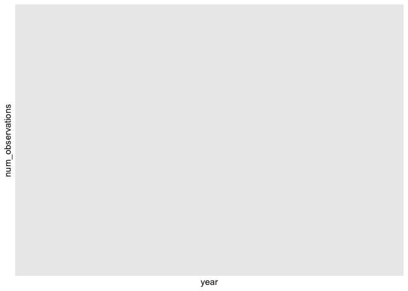

## Instructions
Answer the following questions and complete the exercises in RMarkdown. Please embed all of your code and push your final work to your repository. Your final lab report should be organized, clean, and run free from errors. Remember, you must remove the `#` for the included code chunks to run. Be sure to add your name to the author header above. For any included plots, make sure they are clearly labeled. You are free to use any plot type that you feel best communicates the results of your analysis.  

Make sure to use the formatting conventions of RMarkdown to make your report neat and clean!  

## Load the libraries

```r
library(tidyverse)
library(janitor)
library(naniar)
```

## Desert Ecology
For this assignment, we are going to use a modified data set on [desert ecology](http://esapubs.org/archive/ecol/E090/118/). The data are from: S. K. Morgan Ernest, Thomas J. Valone, and James H. Brown. 2009. Long-term monitoring and experimental manipulation of a Chihuahuan Desert ecosystem near Portal, Arizona, USA. Ecology 90:1708.

```r
deserts <- read_csv("data/surveys_complete.csv") %>% clean_names()
```

```
## Rows: 34786 Columns: 13
## ── Column specification ────────────────────────────────────────────────────────
## Delimiter: ","
## chr (6): species_id, sex, genus, species, taxa, plot_type
## dbl (7): record_id, month, day, year, plot_id, hindfoot_length, weight
## 
## ℹ Use `spec()` to retrieve the full column specification for this data.
## ℹ Specify the column types or set `show_col_types = FALSE` to quiet this message.
```

1. Use the function(s) of your choice to get an idea of its structure, including how NA's are treated. Are the data tidy?  


```r
deserts
```

```
## # A tibble: 34,786 × 13
##    record_id month   day  year plot_id species_id sex   hindfoot_length weight
##        <dbl> <dbl> <dbl> <dbl>   <dbl> <chr>      <chr>           <dbl>  <dbl>
##  1         1     7    16  1977       2 NL         M                  32     NA
##  2         2     7    16  1977       3 NL         M                  33     NA
##  3         3     7    16  1977       2 DM         F                  37     NA
##  4         4     7    16  1977       7 DM         M                  36     NA
##  5         5     7    16  1977       3 DM         M                  35     NA
##  6         6     7    16  1977       1 PF         M                  14     NA
##  7         7     7    16  1977       2 PE         F                  NA     NA
##  8         8     7    16  1977       1 DM         M                  37     NA
##  9         9     7    16  1977       1 DM         F                  34     NA
## 10        10     7    16  1977       6 PF         F                  20     NA
## # ℹ 34,776 more rows
## # ℹ 4 more variables: genus <chr>, species <chr>, taxa <chr>, plot_type <chr>
```

2. How many genera and species are represented in the data? What are the total number of observations? Which species is most/ least frequently sampled in the study?


```r
deserts %>%
  count(genus) %>%
  summarize(total_genus = n_distinct(genus))
```

```
## # A tibble: 1 × 1
##   total_genus
##         <int>
## 1          26
```

There are 26 genera in the data. 

```r
deserts %>%
  count(species) %>%
  summarize(total_species = n_distinct(species))
```

```
## # A tibble: 1 × 1
##   total_species
##           <int>
## 1            40
```

There are 40 species in the data.


```r
deserts %>%
  count(species) %>%
  arrange(n) %>%
  head(10)
```

```
## # A tibble: 10 × 2
##    species          n
##    <chr>        <int>
##  1 clarki           1
##  2 scutalatus       1
##  3 tereticaudus     1
##  4 tigris           1
##  5 uniparens        1
##  6 viridis          1
##  7 leucophrys       2
##  8 savannarum       2
##  9 fuscus           5
## 10 undulatus        5
```

Clarki was the least sampled specie, along with scutalatus, tereticaudus, tigris, uniparens, and viridis. 


```r
deserts %>%
  count(species) %>%
  arrange(n) %>%
  tail(1)
```

```
## # A tibble: 1 × 2
##   species      n
##   <chr>    <int>
## 1 merriami 10596
```
Merriami was the most sampled specie. 

3. What is the proportion of taxa included in this study? Show a table and plot that reflects this count.


```r
deserts %>% 
  tabyl(taxa)
```

```
##     taxa     n      percent
##     Bird   450 0.0129362387
##   Rabbit    75 0.0021560398
##  Reptile    14 0.0004024608
##   Rodent 34247 0.9845052607
```


```r
ggplot(tabyl(deserts, taxa), aes(x = taxa, y = percent)) +
  geom_point(stat = "identity") 
```

<!-- -->


4. For the taxa included in the study, use the fill option to show the proportion of individuals sampled by `plot_type.`


```r
deserts %>%
  group_by(taxa, plot_type) %>%
  summarise(proportion = n() / sum(n())) %>%
  ungroup()
```

```
## `summarise()` has grouped output by 'taxa'. You can override using the
## `.groups` argument.
```

```
## # A tibble: 19 × 3
##    taxa    plot_type                 proportion
##    <chr>   <chr>                          <dbl>
##  1 Bird    Control                            1
##  2 Bird    Long-term Krat Exclosure           1
##  3 Bird    Rodent Exclosure                   1
##  4 Bird    Short-term Krat Exclosure          1
##  5 Bird    Spectab exclosure                  1
##  6 Rabbit  Control                            1
##  7 Rabbit  Long-term Krat Exclosure           1
##  8 Rabbit  Rodent Exclosure                   1
##  9 Rabbit  Short-term Krat Exclosure          1
## 10 Rabbit  Spectab exclosure                  1
## 11 Reptile Control                            1
## 12 Reptile Long-term Krat Exclosure           1
## 13 Reptile Rodent Exclosure                   1
## 14 Reptile Short-term Krat Exclosure          1
## 15 Rodent  Control                            1
## 16 Rodent  Long-term Krat Exclosure           1
## 17 Rodent  Rodent Exclosure                   1
## 18 Rodent  Short-term Krat Exclosure          1
## 19 Rodent  Spectab exclosure                  1
```


```r
ggplot(deserts, aes(x = taxa, fill = plot_type)) +
  geom_bar(position = "fill")
```

<!-- -->

5. What is the range of weight for each species included in the study? Remove any observations of weight that are NA so they do not show up in the plot.


```r
ggplot(deserts %>% filter(!is.na(weight)), aes(x = species, y = weight)) +
  geom_boxplot()
```

<!-- -->


6. Add another layer to your answer from #5 using `geom_point` to get an idea of how many measurements were taken for each species.


```r
ggplot(deserts %>% filter(!is.na(weight)), aes(x = species, y = weight)) +
  geom_boxplot() +
  geom_point(aes(y=max(weight)))
```

<!-- -->


7. [Dipodomys merriami](https://en.wikipedia.org/wiki/Merriam's_kangaroo_rat) is the most frequently sampled animal in the study. How have the number of observations of this species changed over the years included in the study?


```r
deserts %>%
  filter(species == "Dipodomys merriami") %>% 
  group_by(year) %>% 
  summarise(num_observations = n())
```

```
## # A tibble: 0 × 2
## # ℹ 2 variables: year <dbl>, num_observations <int>
```


```r
ggplot(deserts %>% 
         filter(species == "Dipodomys merriami") %>%
         group_by(year) %>%
         summarise(num_observations = n()),
       aes(x = year, y = num_observations)) +
  geom_point()
```

<!-- -->

8. What is the relationship between `weight` and `hindfoot` length? Consider whether or not over plotting is an issue.


```r
names(deserts)
```

```
##  [1] "record_id"       "month"           "day"             "year"           
##  [5] "plot_id"         "species_id"      "sex"             "hindfoot_length"
##  [9] "weight"          "genus"           "species"         "taxa"           
## [13] "plot_type"
```


```r
ggplot(deserts, aes(x = weight, y = hindfoot_length)) +
  geom_point(alpha = 0.5) +
  labs(title = "Relationship between Weight and Hindfoot Length",
       x = "Weight",
       y = "Hindfoot Length")
```

```
## Warning: Removed 4048 rows containing missing values (`geom_point()`).
```

<!-- -->

9. Which two species have, on average, the highest weight? Once you have identified them, make a new column that is a ratio of `weight` to `hindfoot_length`. Make a plot that shows the range of this new ratio and fill by sex.


```r
names(deserts)
```

```
##  [1] "record_id"       "month"           "day"             "year"           
##  [5] "plot_id"         "species_id"      "sex"             "hindfoot_length"
##  [9] "weight"          "genus"           "species"         "taxa"           
## [13] "plot_type"
```


```r
deserts %>%
  group_by(species) %>%
  summarise(avg_weight = mean(weight, na.rm = TRUE)) %>% 
  arrange(desc(avg_weight))
```

```
## # A tibble: 40 × 2
##    species      avg_weight
##    <chr>             <dbl>
##  1 albigula          159. 
##  2 spectabilis       120. 
##  3 spilosoma          93.5
##  4 hispidus           65.6
##  5 fulviventer        58.9
##  6 ochrognathus       55.4
##  7 ordii              48.9
##  8 merriami           43.2
##  9 baileyi            31.7
## 10 leucogaster        31.6
## # ℹ 30 more rows
```


```r
deserts %>%
  mutate(weight_to_hindfoot_ratio = ifelse(is.na(hindfoot_length) | hindfoot_length == 0, NA, weight / hindfoot_length))
```

```
## # A tibble: 34,786 × 14
##    record_id month   day  year plot_id species_id sex   hindfoot_length weight
##        <dbl> <dbl> <dbl> <dbl>   <dbl> <chr>      <chr>           <dbl>  <dbl>
##  1         1     7    16  1977       2 NL         M                  32     NA
##  2         2     7    16  1977       3 NL         M                  33     NA
##  3         3     7    16  1977       2 DM         F                  37     NA
##  4         4     7    16  1977       7 DM         M                  36     NA
##  5         5     7    16  1977       3 DM         M                  35     NA
##  6         6     7    16  1977       1 PF         M                  14     NA
##  7         7     7    16  1977       2 PE         F                  NA     NA
##  8         8     7    16  1977       1 DM         M                  37     NA
##  9         9     7    16  1977       1 DM         F                  34     NA
## 10        10     7    16  1977       6 PF         F                  20     NA
## # ℹ 34,776 more rows
## # ℹ 5 more variables: genus <chr>, species <chr>, taxa <chr>, plot_type <chr>,
## #   weight_to_hindfoot_ratio <dbl>
```


```r
deserts %>%
  mutate(weight_to_hindfoot_ratio = ifelse(is.na(hindfoot_length) | hindfoot_length == 0, NA, weight / hindfoot_length)) %>% 
  ggplot(aes(x = weight_to_hindfoot_ratio, fill = sex, color = species)) +
  geom_histogram(bins=30)
```

```
## Warning: Removed 4048 rows containing non-finite values (`stat_bin()`).
```

<!-- -->

10. Make one plot of your choice! Make sure to include at least two of the aesthetics options you have learned.


```r
ggplot(deserts, aes(x = weight, y = hindfoot_length, color = species, shape = plot_type)) +
  geom_point(size = 0.5)
```

```
## Warning: Removed 4048 rows containing missing values (`geom_point()`).
```

<!-- -->

## Push your final code to GitHub!
Please be sure that you check the `keep md` file in the knit preferences. 
