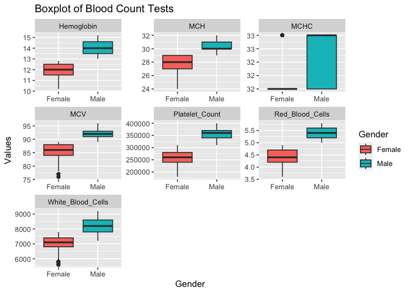
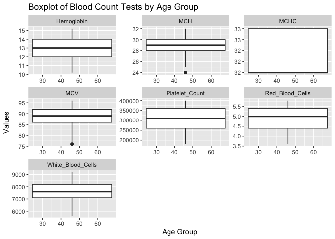

## Instructions
This homework is a bit less traditional this week. There are some errors in the code below. In addition add notes and titles to the code chunks that explains what the code chunck does. Use AI tools, notes from class, or any other resources to help fix the errors. Feel free to edit any plots to your preference. Don't forget to answer the two questions at the bottom. Upon completion, you should not have to '#' out any of the code chunks.

Push your final work to your repository. Your final lab report should be organized, clean, and run free from errors. Remember, you must remove the `#` for the included code chunks to run. Be sure to add your name to the author header above.   

Again make sure to use the formatting conventions of RMarkdown to make your report neat and clean!  


```r
library(tidyverse)
```

```
## ── Attaching core tidyverse packages ──────────────────────── tidyverse 2.0.0 ──
## ✔ dplyr     1.1.4     ✔ readr     2.1.4
## ✔ forcats   1.0.0     ✔ stringr   1.5.1
## ✔ ggplot2   3.4.4     ✔ tibble    3.2.1
## ✔ lubridate 1.9.3     ✔ tidyr     1.3.0
## ✔ purrr     1.0.2     
## ── Conflicts ────────────────────────────────────────── tidyverse_conflicts() ──
## ✖ dplyr::filter() masks stats::filter()
## ✖ dplyr::lag()    masks stats::lag()
## ℹ Use the conflicted package (<http://conflicted.r-lib.org/>) to force all conflicts to become errors
```

```r
library(janitor)
```

```
## 
## Attaching package: 'janitor'
## 
## The following objects are masked from 'package:stats':
## 
##     chisq.test, fisher.test
```

```r
library(dplyr)
```


1.

```r
blood_count <- read_csv("data/blood_count_dataset.csv")
```

```
## Rows: 417 Columns: 9
## ── Column specification ────────────────────────────────────────────────────────
## Delimiter: ","
## chr (1): Gender
## dbl (8): Age, Hemoglobin, Platelet_Count, White_Blood_Cells, Red_Blood_Cells...
## 
## ℹ Use `spec()` to retrieve the full column specification for this data.
## ℹ Specify the column types or set `show_col_types = FALSE` to quiet this message.
```

2. 

```r
glimpse(blood_count)
```

```
## Rows: 417
## Columns: 9
## $ Age               <dbl> 68, 25, 57, 28, 38, 47, 37, 30, 35, 22, 41, 34, 40, …
## $ Gender            <chr> "Female", "Male", "Male", "Female", "Male", "Female"…
## $ Hemoglobin        <dbl> 10.4, 13.8, 13.5, 12.7, 14.9, 12.0, 14.5, 11.8, 11.5…
## $ Platelet_Count    <dbl> 180000, 320000, 370000, 290000, 380000, 260000, 3800…
## $ White_Blood_Cells <dbl> 5700, 7500, 8500, 7800, 8700, 7000, 8700, 7000, 7100…
## $ Red_Blood_Cells   <dbl> 3.7, 5.4, 5.1, 4.8, 5.7, 4.4, 5.7, 4.2, 4.2, 5.6, 4.…
## $ MCV               <dbl> 77, 92, 90, 86, 95, 87, 95, 84, 84, 93, 88, 85, 96, …
## $ MCH               <dbl> 25, 30, 29, 29, 31, 28, 31, 27, 27, 31, 29, 28, 32, …
## $ MCHC              <dbl> 32, 32, 32, 33, 33, 32, 33, 32, 32, 32, 33, 32, 33, …
```

3. 

```r
blood_count %>% 
  group_by(Gender) %>% 
  summarize(
    min = min(Red_Blood_Cells),
    mean = mean(Red_Blood_Cells),
    max = max(Red_Blood_Cells)
  )
```

```
## # A tibble: 2 × 4
##   Gender   min  mean   max
##   <chr>  <dbl> <dbl> <dbl>
## 1 Female   3.6  4.36   4.9
## 2 Male     5    5.38   5.8
```

```r
names(blood_count)
```

```
## [1] "Age"               "Gender"            "Hemoglobin"       
## [4] "Platelet_Count"    "White_Blood_Cells" "Red_Blood_Cells"  
## [7] "MCV"               "MCH"               "MCHC"
```


4. 

```r
options(scipen = 999, digits = 2)

blood_count %>% 
  filter(Gender == "male") %>%
  select(3:9) %>%
  colMeans(na.rm = TRUE)
```

```
##        Hemoglobin    Platelet_Count White_Blood_Cells   Red_Blood_Cells 
##               NaN               NaN               NaN               NaN 
##               MCV               MCH              MCHC 
##               NaN               NaN               NaN
```

5. 

```r
blood_count %>% 
  filter(Gender == "Female") %>%
  select(3:9) %>%
  colMeans(na.rm = TRUE)
```

```
##        Hemoglobin    Platelet_Count White_Blood_Cells   Red_Blood_Cells 
##              11.9          255913.5            6967.8               4.4 
##               MCV               MCH              MCHC 
##              84.9              27.7              32.2
```


6. FIX


```r
blood_count %>%
  pivot_longer(cols = Hemoglobin:MCHC, names_to = "Test", values_to = "Values") %>%
  ggplot(aes(x = Gender, y = Values, fill = Gender, group = Gender)) +
  geom_boxplot() +
  facet_wrap(~ Test, scales = "free") +
  labs(title = "Boxplot of Blood Count Tests",
       x = "Gender",
       y = "Values")
```

<!-- -->

```r
names(blood_count)
```

```
## [1] "Age"               "Gender"            "Hemoglobin"       
## [4] "Platelet_Count"    "White_Blood_Cells" "Red_Blood_Cells"  
## [7] "MCV"               "MCH"               "MCHC"
```


7. 

```r
grouped_bc <- blood_count %>%
  mutate(Age_Group = case_when(
    Age >= 20 & Age <= 29 ~ "20s",
    Age >= 30 & Age <= 39 ~ "30s",
    Age >= 40 & Age <= 49 ~ "40s",
    Age >= 50 & Age <= 59 ~ "50s",
    Age >= 60 ~ "60s")) # Combine 70s with 60s

head(grouped_bc)
```

```
## # A tibble: 6 × 10
##     Age Gender Hemoglobin Platelet_Count White_Blood_Cells Red_Blood_Cells   MCV
##   <dbl> <chr>       <dbl>          <dbl>             <dbl>           <dbl> <dbl>
## 1    68 Female       10.4         180000              5700             3.7    77
## 2    25 Male         13.8         320000              7500             5.4    92
## 3    57 Male         13.5         370000              8500             5.1    90
## 4    28 Female       12.7         290000              7800             4.8    86
## 5    38 Male         14.9         380000              8700             5.7    95
## 6    47 Female       12           260000              7000             4.4    87
## # ℹ 3 more variables: MCH <dbl>, MCHC <dbl>, Age_Group <chr>
```

8. 

```r
blood_count %>%
  pivot_longer(cols = 3:9, names_to = "Test", values_to = "Values") %>%
  ggplot(aes(x = Age, y = Values, fill = Age)) +
  geom_boxplot() +
  facet_wrap(~ Test, scales = "free") +  # Facet by the "Test" variable
  labs(title = "Boxplot of Blood Count Tests by Age Group",
       x = "Age Group",
       y = "Values")
```

```
## Warning: Continuous x aesthetic
## ℹ did you forget `aes(group = ...)`?
```

```
## Warning: The following aesthetics were dropped during statistical transformation: fill
## ℹ This can happen when ggplot fails to infer the correct grouping structure in
##   the data.
## ℹ Did you forget to specify a `group` aesthetic or to convert a numerical
##   variable into a factor?
## The following aesthetics were dropped during statistical transformation: fill
## ℹ This can happen when ggplot fails to infer the correct grouping structure in
##   the data.
## ℹ Did you forget to specify a `group` aesthetic or to convert a numerical
##   variable into a factor?
## The following aesthetics were dropped during statistical transformation: fill
## ℹ This can happen when ggplot fails to infer the correct grouping structure in
##   the data.
## ℹ Did you forget to specify a `group` aesthetic or to convert a numerical
##   variable into a factor?
## The following aesthetics were dropped during statistical transformation: fill
## ℹ This can happen when ggplot fails to infer the correct grouping structure in
##   the data.
## ℹ Did you forget to specify a `group` aesthetic or to convert a numerical
##   variable into a factor?
## The following aesthetics were dropped during statistical transformation: fill
## ℹ This can happen when ggplot fails to infer the correct grouping structure in
##   the data.
## ℹ Did you forget to specify a `group` aesthetic or to convert a numerical
##   variable into a factor?
## The following aesthetics were dropped during statistical transformation: fill
## ℹ This can happen when ggplot fails to infer the correct grouping structure in
##   the data.
## ℹ Did you forget to specify a `group` aesthetic or to convert a numerical
##   variable into a factor?
## The following aesthetics were dropped during statistical transformation: fill
## ℹ This can happen when ggplot fails to infer the correct grouping structure in
##   the data.
## ℹ Did you forget to specify a `group` aesthetic or to convert a numerical
##   variable into a factor?
```

<!-- -->
9. What are two drawbacks and two benefits of AI?
Two benefits of AI include enhanced efficiency through automation and improved decision-making through data analysis. Drawbacks include the potential for job displacement due to automation and ethical concerns surrounding data privacy and biases in algorithms.

10. Do you think you will use AI for coding in the future? Why or why not?
I might for some troubleshooting or if I have to input a lot of the same code into similar questions to use my time more efficiently. I am thinking in terms of using it at my future job. At the end of th day, I would most likely utilize my own knowledge and use AI as a support/ help with smaller issues.

## Push your final code to GitHub!
Please be sure that you check the `keep md` file in the knit preferences. 
